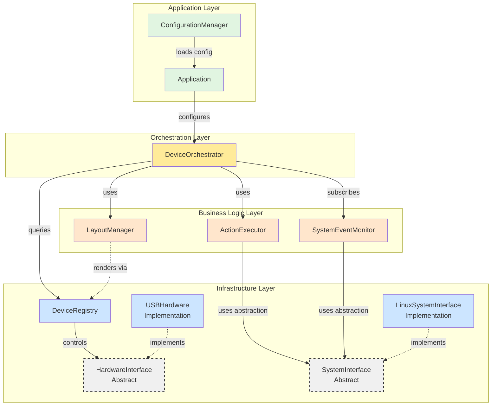
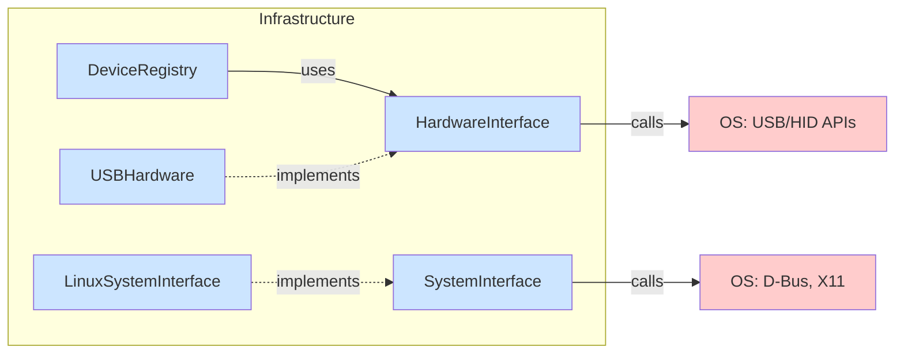
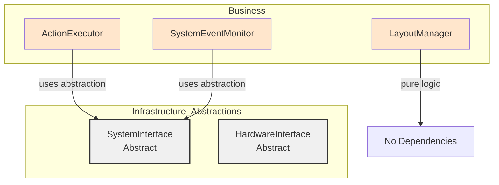
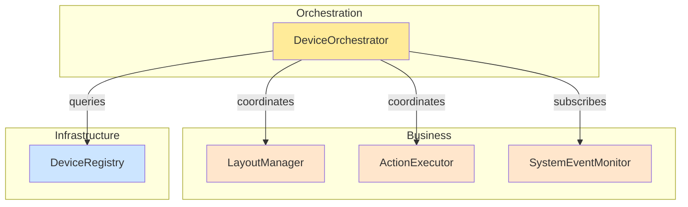
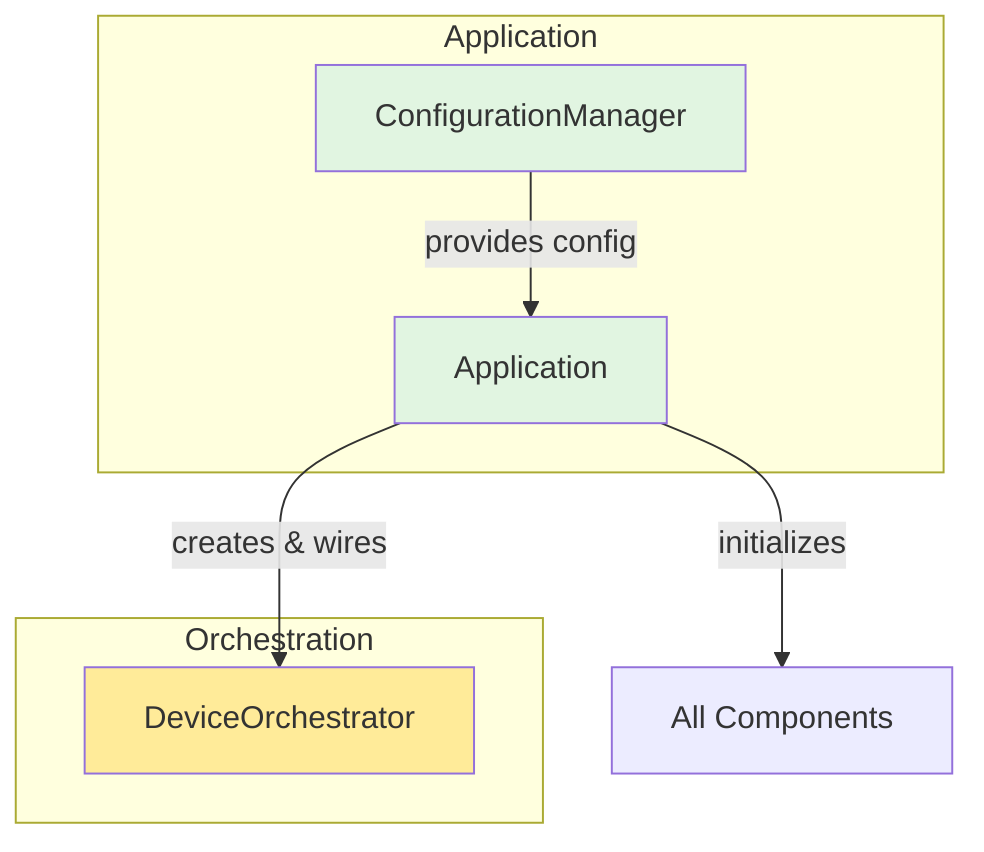
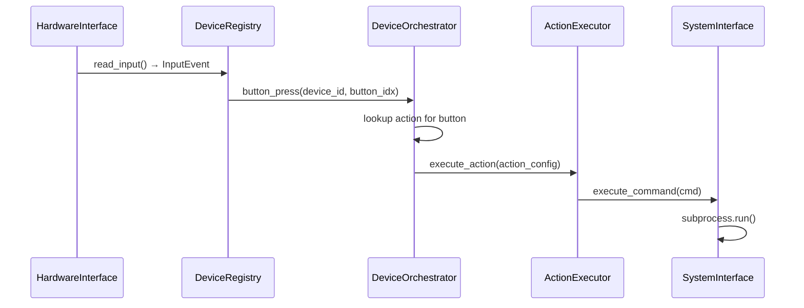
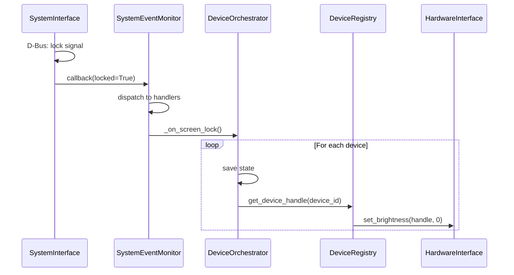
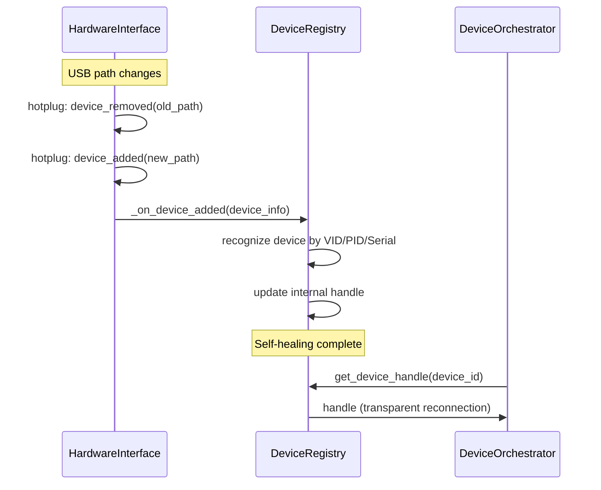

# Layered Architecture Coupling Diagram

## Purpose

This document defines the **allowed and forbidden dependencies** between components in the StreamDock layered architecture. It serves as the reference for architectural compliance validation.

## Dependency Rules

### Core Principles

1. **Dependencies flow downward** - Higher layers depend on lower layers, never upward
2. **Infrastructure has zero dependencies** - Infrastructure layer is self-contained
3. **Business logic is pure** - Business logic depends only on abstractions, not implementations
4. **Orchestration is the hub** - Only orchestration coordinates across layers

### Layer Dependency Matrix

| From Layer ↓ To Layer → | Infrastructure | Business | Orchestration | Application |
|--------------------------|----------------|----------|---------------|-------------|
| **Infrastructure**       | ✅ Internal    | ❌ Never  | ❌ Never       | ❌ Never     |
| **Business**             | ✅ Abstractions | ✅ Internal | ❌ Never    | ❌ Never     |
| **Orchestration**        | ✅ Via Business | ✅ Allowed | ✅ Internal  | ❌ Never     |
| **Application**          | ✅ Via Orch.  | ✅ Via Orch. | ✅ Allowed  | ✅ Internal |

**Legend:**
- ✅ **Allowed** - This dependency is permitted
- ❌ **Never** - This dependency violates architecture principles
- **Internal** - Dependencies within the same layer
- **Abstractions** - Depends only on interfaces, not concrete implementations
- **Via X** - Indirect dependency through another layer

---

## Full Dependency Graph



**Key:**
- **Solid arrows** (→) - Direct dependencies
- **Dotted arrows** (-.→) - Implementation or indirect dependency
- **Dashed boxes** - Abstract interfaces

---

## Layer-Specific Coupling Rules

### Infrastructure Layer Rules



**Rules:**
- ✅ **Can depend on:** OS APIs, standard library, other infrastructure components
- ❌ **Cannot depend on:** Business logic, Orchestration, Application
- ✅ **Can expose:** Abstract interfaces
- ✅ **Should be:** Fully mockable for testing

**Example - CORRECT:**
```python
# infrastructure/device_registry.py
class DeviceRegistry:
    def __init__(self, hardware_interface: HardwareInterface):
        self._hardware = hardware_interface  # Infrastructure → Infrastructure ✅
```

**Example - INCORRECT:**
```python
# infrastructure/device_registry.py
from StreamDock.business_logic.layout_manager import LayoutManager  # ❌ NEVER!

class DeviceRegistry:
    def __init__(self, layout_manager: LayoutManager):  # Upward dependency ❌
        self._layouts = layout_manager
```

---

### Business Logic Layer Rules



**Rules:**
- ✅ **Can depend on:** Infrastructure *abstractions* (interfaces/ABC), other business components
- ❌ **Cannot depend on:** Infrastructure *implementations*, Orchestration, Application
- ✅ **Should be:** Testable without mocks (pure logic) or with simple interface mocks
- ✅ **Must:** Depend only on injected dependencies

**Example - CORRECT:**
```python
# business/action_executor.py
from StreamDock.infrastructure.system_interface import SystemInterface  # Abstract ✅

class ActionExecutor:
    def __init__(self, system_interface: SystemInterface):  # Interface injection ✅
        self._system = system_interface
```

**Example - INCORRECT:**
```python
# business/action_executor.py
from StreamDock.infrastructure.linux_system import LinuxSystemInterface  # Implementation ❌

class ActionExecutor:
    def __init__(self):
        self._system = LinuxSystemInterface()  # Hard-coded concrete implementation ❌
```

---

### Orchestration Layer Rules



**Rules:**
- ✅ **Can depend on:** Business components, Infrastructure components, other orchestration
- ❌ **Cannot depend on:** Application layer
- ✅ **Is the ONLY layer** that bridges Business ↔ Infrastructure
- ✅ **Should:** Coordinate, not implement logic

**Example - CORRECT:**
```python
# orchestration/device_orchestrator.py
class DeviceOrchestrator:
    def __init__(self, registry: DeviceRegistry, layouts: LayoutManager,
                 actions: ActionExecutor, events: SystemEventMonitor):
        self._registry = registry      # Infrastructure ✅
        self._layouts = layouts        # Business ✅
        self._actions = actions        # Business ✅
        self._events = events          # Business ✅
        
        # Wire events to handlers
        events.on_screen_lock(self._on_screen_lock)  # Coordination ✅
```

**Example - INCORRECT:**
```python
# orchestration/device_orchestrator.py
class DeviceOrchestrator:
    def select_layout(self, window_info):
        # Implementing business logic in orchestration ❌
        for rule in self._rules:  # This belongs in LayoutManager!
            if rule.matches(window_info):
                return rule.layout
```

---

### Application Layer Rules



**Rules:**
- ✅ **Can depend on:** Everything (for wiring only)
- ❌ **Cannot:** Implement business logic or device operations
- ✅ **Should:** Only wire dependencies and bootstrap
- ✅ **Is the:** Dependency injection container

**Example - CORRECT:**
```python
# application/application.py
class Application:
    def __init__(self, config_path):
        # Create infrastructure
        hw = USBHardware()
        sys_if = LinuxSystemInterface()
        registry = DeviceRegistry(hw)
        
        # Create business logic
        layouts = LayoutManager(config.get_layouts())
        actions = ActionExecutor(sys_if)
        events = SystemEventMonitor(sys_if)
        
        # Create orchestration
        orchestrator = DeviceOrchestrator(registry, layouts, actions, events)
        
        # Wire events ✅ - This is application's job
        events.on_screen_lock(orchestrator._on_screen_lock)
```

**Example - INCORRECT:**
```python
# application/application.py
class Application:
    def handle_button_press(self, button_id):
        # Application shouldn't implement functionality ❌
        if button_id == 1:
            subprocess.run(["firefox"])  # This belongs in ActionExecutor!
```

---

## Interaction Sequence Diagrams

### Sequence: Button Press



**Coupling Check:** ✅ All arrows point downward or horizontally within layer

---

### Sequence: Screen Lock Event



**Coupling Check:** ✅ Event flows up, then coordination flows down

---

### Sequence: Device Reconnection



**Coupling Check:** ✅ Registry handles reconnection internally, no upward notification needed

---

## Anti-Patterns (What NOT To Do)

### Anti-Pattern 1: Business Logic in Infrastructure

❌ **WRONG:**
```python
# infrastructure/device_registry.py
class DeviceRegistry:
    def on_device_added(self, device):
        # Don't implement business logic here!
        if device.vendor_id == STREAM_DECK_VID:
            layout = self._select_default_layout()  # Business logic ❌
            self._render_layout(layout, device)     # Business operation ❌
```

✅ **CORRECT:**
```python
# infrastructure/device_registry.py
class DeviceRegistry:
    def on_device_added(self, device):
        # Just track it
        self._devices[device.id] = device  # Infrastructure responsibility ✅
        # Let orchestration handle business logic
```

---

### Anti-Pattern 2: Infrastructure Implementation in Business

❌ **WRONG:**
```python
# business/action_executor.py
import subprocess  # Direct OS dependency ❌

class ActionExecutor:
    def execute_command(self, cmd):
        subprocess.run(cmd, shell=True)  # Directly calling OS ❌
```

✅ **CORRECT:**
```python
# business/action_executor.py
from StreamDock.infrastructure.system_interface import SystemInterface

class ActionExecutor:
    def __init__(self, system_interface: SystemInterface):
        self._system = system_interface  # Use abstraction ✅
    
    def execute_command(self, cmd):
        self._system.execute_command(cmd)  # Delegate to infrastructure ✅
```

---

### Anti-Pattern 3: Skipping Layers

❌ **WRONG:**
```python
# application/application.py
class Application:
    def run(self):
        # Skip orchestration, call infrastructure directly ❌
        devices = self._hardware_interface.enumerate_devices()
        for dev in devices:
            self._hardware_interface.set_brightness(dev, 100)
```

✅ **CORRECT:**
```python
# application/application.py
class Application:
    def run(self):
        # Go through orchestration ✅
        self._orchestrator.initialize_all_devices()
```

---

## Validation Checklist

When adding a new component or dependency:

- [ ] **Check layer placement** - Is the component in the right layer?
- [ ] **Check dependencies** - Do all arrows point down the stack?
- [ ] **Check abstractions** - Does business logic depend only on interfaces?
- [ ] **Check orchestration** - Is cross-layer coordination only in DeviceOrchestrator?
- [ ] **Update this diagram** - Add new component to appropriate visual diagram
- [ ] **Write tests** - Are dependencies mockable for testing?

## Tools for Validation

### Manual Check
```bash
# Check imports in a file to verify dependencies
cd /home/speled/git_repositories/StreamDockForLinux
grep "^from StreamDock" src/StreamDock/business/*.py | grep -v "infrastructure.*interface"
# Should only import infrastructure ABSTRACTIONS, not implementations
```

### Future: Automated Validation
```python
# Future pre-commit hook idea
def validate_dependencies(file_path):
    layer = detect_layer(file_path)
    imports = extract_imports(file_path)
    for imp in imports:
        if violates_layer_rules(layer, imp):
            raise ArchitectureViolation(f"{file_path} violates layer rules")
```

## Summary

**The Golden Rule:** Dependencies always flow downward. Infrastructure knows nothing about business logic, andOrchestration is the ONLY place where layers meet.

When in doubt: **Would this component work if I swapped out the layer below it?** If not, you're probably violating dependency inversion.
