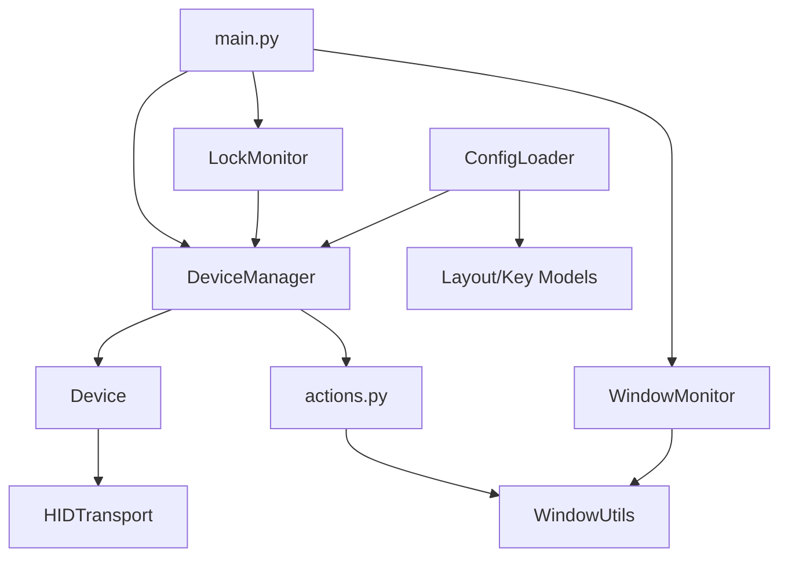
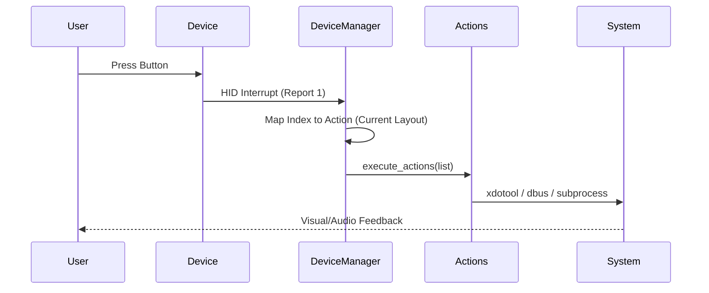
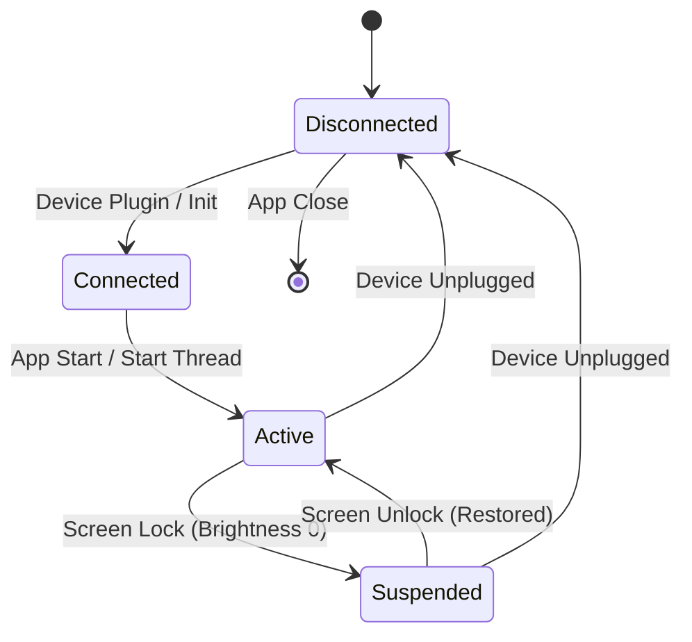

# Dependency Context Map

This document visualizes the core architecture, data flow, and component relationships within the `src/StreamDock` project.

## 1. High-Level Component Architecture

## 2. Data Flow: Hardware Event to System Action

## 3. Device Lifecycle & State Machine

## 4. Logical Dependencies (Internal Scope)

| Component | Depends On | Responsibilities |
| :--- | :--- | :--- |
| `DeviceManager` | `Device`, `ConfigLoader`, `actions` | Thread management, key-to-action routing. |
| `Device` | `HIDTransport` | High-level brightness and image commands. |
| `WindowMonitor` | `WindowUtils` | Polling for focus changes, triggering layout swaps. |
| `LockMonitor` | `DeviceManager` | D-Bus signal listening, power saving. |
| `actions.py` | `WindowUtils` | Input emulation and system integration. |

---

> [!NOTE]
> These diagrams represent the `src/StreamDock` core logic. External tools like `Configer` are excluded from this map.
