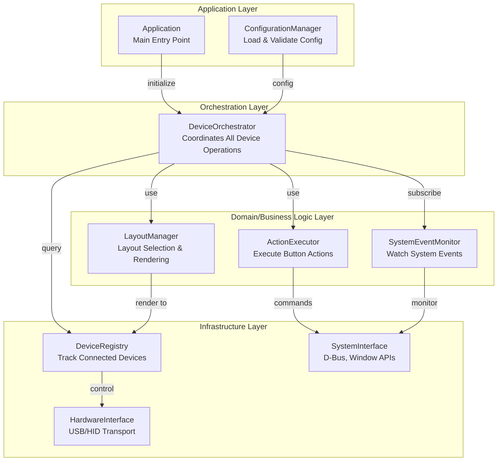
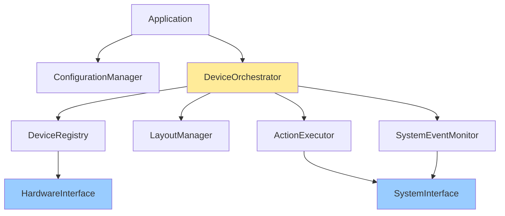
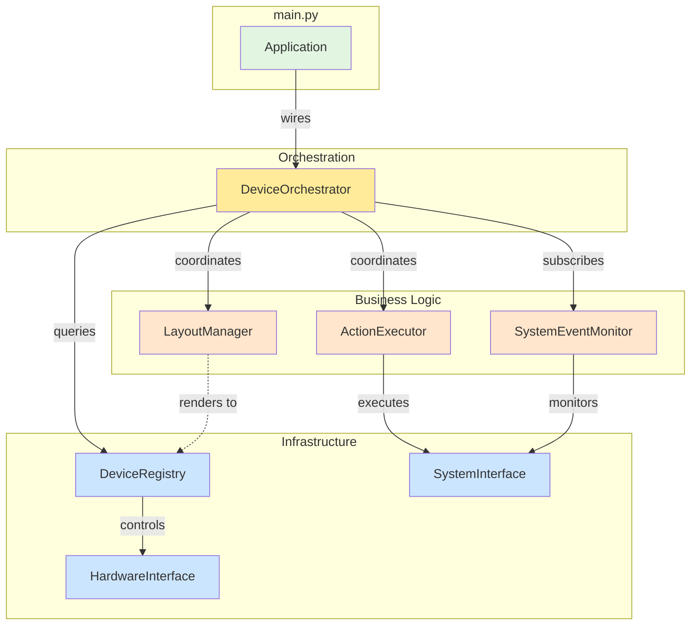

# StreamDock Application: Layered Architecture Design

## Design Principles

1. **Layered Architecture** - Clear boundaries between hardware, business logic, and application
2. **Dependency Inversion** - High-level modules don't depend on low-level modules
3. **Single Responsibility** - Each component has exactly one reason to change
4. **Minimal Coupling** - Components interact through well-defined interfaces
5. **Maximum Cohesion** - Related functionality grouped together
6. **Easy Extension** - New features added without modifying existing code

---

## Architecture Layers



---

## Component Breakdown

### 1. **HardwareInterface** (Infrastructure Layer)

**Responsibility:** Abstract USB/HID communication

```python
class HardwareInterface:
    """Pure hardware abstraction - knows nothing about application logic."""
    
    def enumerate_devices(self, vid, pid) -> List[DeviceInfo]
    def open_device(self, device_info) -> DeviceHandle
    def close_device(self, handle) -> None
    def set_brightness(self, handle, level) -> None
    def send_image(self, handle, image_data, button_index) -> None
    def read_input(self, handle) -> Optional[InputEvent]
    def monitor_hotplug(self, callback) -> None
```

**Dependencies:** None (pure I/O)

**Pros:**
- Can swap USB library (hidapi → libusb) without touching app logic
- Testable with mock hardware
- Reusable across different applications

---

### 2. **DeviceRegistry** (Infrastructure Layer)

**Responsibility:** Track device lifecycle (add/remove/reconnect)

```python
class DeviceRegistry:
    """Maintains the registry of connected devices and their state."""
    
    def __init__(self, hardware_interface):
        self._hardware = hardware_interface
        self._devices = {}  # {device_id: DeviceState}
    
    def discover_devices(self) -> List[str]  # Returns device IDs
    def get_device_handle(self, device_id) -> DeviceHandle
    def is_device_connected(self, device_id) -> bool
    def reconnect_device(self, device_id) -> bool
    
    # Called by hardware interface when hotplug detected
    def _on_device_added(self, device_info) -> None
    def _on_device_removed(self, device_path) -> None
```

**Dependencies:** HardwareInterface

**Key Feature:** Handles USB path changes transparently
- Tracks devices by VID/PID/Serial, not by USB path
- When device reconnects at new path, automatically updates handle
- Notifies nobody - just maintains correct state

**Pros:**
- Encapsulates all reconnection logic in one place
- No other component needs to know about USB paths
- Self-healing (auto-reconnect on path change)

---

### 3. **SystemInterface** (Infrastructure Layer)

**Responsibility:** Abstract OS-level system APIs (absorbs `WindowUtils` functionality)

```python
class SystemInterface(ABC):
    """OS integration - D-Bus, window management, process control.
    
    Implemented by LinuxSystemInterface which delegates to WindowUtils.
    """
    
    # Tool Availability (from WindowUtils)
    def is_kdotool_available(self) -> bool
    def is_xdotool_available(self) -> bool
    def is_dbus_available(self) -> bool
    def is_pactl_available(self) -> bool
    
    # Lock/Unlock monitoring
    def monitor_screen_lock(self, callback) -> None
    def poll_lock_state(self) -> bool
    
    # Window monitoring (delegated to WindowUtils)
    def get_active_window(self) -> WindowInfo
    def search_window_by_class(self, class_name: str) -> Optional[str]
    def activate_window(self, window_id: str) -> bool
    
    # Process execution
    def execute_command(self, command) -> None
    def execute_detached(self, command) -> None
    def emulate_key_combo(self, combo: str) -> None
    def type_text(self, text: str, delay: float = 0.001) -> None
```

**Implementation Note:** `LinuxSystemInterface` delegates to the existing `WindowUtils` module, keeping that code unchanged while providing a clean interface.

**Dependencies:** None (pure I/O)

**Pros:**
- Can mock for testing
- Platform abstraction (Linux → macOS → Windows)
- All OS-specific code isolated here
- `WindowUtils` preserved for backward compatibility

---

### 4. **SystemEventMonitor** (Business Logic Layer)

**Responsibility:** Watch system events and notify subscribers

```python
class SystemEventMonitor:
    """Monitors system-level events and dispatches to handlers."""
    
    def __init__(self, system_interface):
        self._system = system_interface
        self._lock_handlers = []
        self._unlock_handlers = []
        self._window_change_handlers = []
    
    def on_screen_lock(self, handler) -> None
    def on_screen_unlock(self, handler) -> None
    def on_window_change(self, handler) -> None
    
    def start_monitoring(self) -> None
    def stop_monitoring(self) -> None
```

**Dependencies:** SystemInterface

**Design Pattern:** Pure event dispatcher
- No business logic - just routes events
- Handlers are registered by orchestrator
- Completely decoupled from device operations

**Pros:**
- Easy to add new event types
- Testable (inject mock events)
- No coupling to hardware

---

### 5. **LayoutManager** (Business Logic Layer)

**Responsibility:** Manage layouts and what's displayed

```python
class LayoutManager:
    """Decides which layout to show and renders it."""
    
    def __init__(self, config):
        self._layouts = {}  # {name: LayoutDefinition}
        self._rules = []    # Window matching rules
        self._current_layout_id = None
    
    def load_layouts(self, layout_configs) -> None
    def add_window_rule(self, pattern, layout_name) -> None
    
    def select_layout_for_window(self, window_info) -> Optional[str]
    def get_current_layout(self) -> str
    def set_layout(self, layout_name) -> None
    
    def render_layout(self, layout_name, render_target) -> None
```

**Dependencies:** None (pure logic)

**Design Pattern:** Strategy pattern for layout selection
- Rules are declarative configuration
- No knowledge of devices or rendering mechanism
- Just logic: "given window X, which layout?"

**Pros:**
- Testable without hardware
- Can change layout selection algorithm independently
- Rule engine can grow complex without affecting other layers

---

### 6. **ActionExecutor** (Business Logic Layer)

**Responsibility:** Execute actions when buttons are pressed

```python
class ActionExecutor:
    """Executes actions in response to button presses."""
    
    def __init__(self, system_interface):
        self._system = system_interface
        self._action_handlers = {}  # {action_type: handler}
    
    def register_action_type(self, action_type, handler) -> None
    def execute_action(self, action_config) -> None
    
    # Built-in action types
    def _handle_command(self, config) -> None
    def _handle_application(self, config) -> None
    def _handle_layout_switch(self, config) -> None
```

**Dependencies:** SystemInterface

**Design Pattern:** Command pattern
- Each action type is a pluggable handler
- Easy to add new action types
- No coupling to layouts or devices

**Pros:**
- Extensible action system
- Actions can be composed
- Testable independently

---

### 7. **DeviceOrchestrator** (Orchestration Layer)

**Responsibility:** Coordinate all device operations and system events

```python
class DeviceOrchestrator:
    """
    The conductor - coordinates device operations with system events.
    This is the ONLY component that knows about both devices AND system state.
    """
    
    def __init__(self, device_registry, layout_manager, 
                 action_executor, event_monitor):
        self._registry = device_registry
        self._layouts = layout_manager
        self._actions = action_executor
        self._events = event_monitor
        
        self._device_states = {}  # {device_id: DeviceState}
    
    def initialize_device(self, device_id, default_layout) -> None:
        """Set up a newly discovered device."""
        
    def handle_button_press(self, device_id, button_index) -> None:
        """Route button press to appropriate action."""
        
    # System event handlers (registered with SystemEventMonitor)
    def _on_screen_lock(self) -> None:
        """Turn off all devices, save state."""
        for device_id in self._registry.discover_devices():
            state = self._device_states[device_id]
            state.saved_brightness = self._get_brightness(device_id)
            self._set_power_mode(device_id, PowerMode.STANDBY)
    
    def _on_screen_unlock(self) -> None:
        """Restore all devices."""
        for device_id in self._registry.discover_devices():
            # Registry handles reconnection transparently
            if self._registry.is_device_connected(device_id):
                state = self._device_states[device_id]
                self._set_power_mode(device_id, PowerMode.ACTIVE)
                self._restore_brightness(device_id, state.saved_brightness)
                self._layouts.render_layout(state.current_layout, device_id)
    
    def _on_window_change(self, window_info) -> None:
        """Auto-switch layout based on window rules."""
        new_layout = self._layouts.select_layout_for_window(window_info)
        if new_layout:
            for device_id in self._registry.discover_devices():
                self._switch_layout(device_id, new_layout)
```

**Dependencies:** DeviceRegistry, LayoutManager, ActionExecutor, SystemEventMonitor

**Key Insight:** This is the ONLY component that bridges system events ↔ device operations
- All coupling happens HERE, in one controlled place
- Other components remain decoupled
- Easy to reason about application flow

**State Management:**
```python
class DeviceState:
    current_layout: str
    saved_brightness: int
    power_mode: PowerMode
```

**Pros:**
- Single place to understand application behavior
- Easy to modify coordination logic
- Can add new event types without changing other layers
- All complexity is intentional and visible

---

### 8. **ConfigurationManager** (Application Layer)

**Responsibility:** Load and validate configuration

```python
class ConfigurationManager:
    """Load YAML config and build component configuration."""
    
    def __init__(self, config_path):
        self._config = self._load_yaml(config_path)
        self._validate()
    
    def get_layouts(self) -> Dict[str, LayoutConfig]
    def get_window_rules(self) -> List[WindowRule]
    def get_device_settings(self) -> DeviceSettings
    def is_feature_enabled(self, feature_name) -> bool
```

**Dependencies:** None

**Pros:**
- Configuration parsing isolated
- Validation happens early
- Components get clean config objects (not raw YAML)

---

### 9. **Application** (Application Layer)

**Responsibility:** Bootstrap and wire everything together

```python
class Application:
    """Main application entry point - dependency injection container."""
    
    def __init__(self, config_path):
        # Load config
        config = ConfigurationManager(config_path)
        
        # Infrastructure layer
        hw = HardwareInterface()
        sys_if = SystemInterface()
        registry = DeviceRegistry(hw)
        
        # Business logic layer
        layouts = LayoutManager(config.get_layouts())
        actions = ActionExecutor(sys_if)
        events = SystemEventMonitor(sys_if)
        
        # Orchestration layer
        orchestrator = DeviceOrchestrator(registry, layouts, actions, events)
        
        # Wire up event handlers
        if config.is_feature_enabled('screen_lock_monitor'):
            events.on_screen_lock(orchestrator._on_screen_lock)
            events.on_screen_unlock(orchestrator._on_screen_unlock)
        
        if config.is_feature_enabled('window_monitor'):
            events.on_window_change(orchestrator._on_window_change)
            for rule in config.get_window_rules():
                layouts.add_window_rule(rule.pattern, rule.layout)
        
        # Start monitoring
        events.start_monitoring()
        
        # Discover and initialize devices
        for device_id in registry.discover_devices():
            orchestrator.initialize_device(device_id, config.default_layout)
    
    def run(self):
        """Main event loop."""
        while True:
            # Poll for button presses
            # Or use async event loop
            pass
```

---

## How the Bug Would Be Prevented

### Scenario: Device path changes (docking station → direct USB)

**Old architecture:**
1. LockMonitor caches path `1-2.1:1.0`
2. Device physically moves to `1-1:1.0`
3. LockMonitor tries to find old path → crash ❌

**New architecture:**
1. DeviceRegistry tracks device by VID/PID/Serial (NOT path)
2. HardwareInterface detects hotplug event: `device_removed(1-2.1:1.0)` then `device_added(1-1:1.0)`
3. DeviceRegistry recognizes same device (VID/PID/Serial match)
4. DeviceRegistry transparently updates internal handle
5. DeviceOrchestrator calls `registry.is_device_connected(device_id)` → returns True
6. Device operations continue normally ✅

**No path caching. No manual reconnection logic. Self-healing.**

---

## Dependency Graph



**Dependency Rules:**
- Arrows point from high-level (application) to low-level (infrastructure)
- No circular dependencies
- Infrastructure has ZERO dependencies
- Orchestrator is the only "hub" - all coordination happens there

---

## Benefits Summary

### Minimal Coupling
✅ Each layer depends only on layer below  
✅ Infrastructure components have zero dependencies  
✅ Business logic doesn't know about hardware  
✅ All coupling concentrated in DeviceOrchestrator  

### Easy Extension
✅ New action types: Register in ActionExecutor  
✅ New system events: Add to SystemEventMonitor  
✅ New layout rules: Extend LayoutManager  
✅ New hardware: Swap HardwareInterface implementation  

### Testability
✅ Every component mockable  
✅ Business logic testable without hardware  
✅ Integration tests use mock HardwareInterface  
✅ System tests use real hardware  

### Maintainability
✅ Clear responsibility boundaries  
✅ Changes localized to single component  
✅ Easy to reason about data flow  
✅ Self-documenting architecture  

---

## Migration Strategy

> **Detailed Plan:** See [layered_architecture_migration.md](file:///home/speled/git_repositories/StreamDockForLinux/docs/feature_proposals/layered_architecture_migration.md) for complete implementation details.

### Phase -1: Pre-Migration Hardening
- Capture baseline test results
- Add integration tests for lock/unlock cycle and device reconnection

### Phase 0: Preparation & Documentation
- Create architecture documentation
- Update workflows for architecture compliance
- Define test strategy

### Phase 1: Infrastructure Layer
1. Build HardwareInterface wrapping `HIDTransport`
2. Build DeviceRegistry with path-independent tracking
3. Build SystemInterface absorbing `WindowUtils` (delegating, not replacing)

### Phase 2: Business Logic Layer
4. Add data classes: `KeyConfig`, `LayoutConfig`, `WindowRule`
5. Extract LayoutManager from current Layout classes
6. Extract ActionExecutor from current action handling
7. Build SystemEventMonitor wrapping lock/window monitors

### Phase 3: Orchestration Layer
8. Build DeviceOrchestrator
9. Migrate lock/unlock logic from LockMonitor
10. Migrate window rules logic

### Phase 4: Application Layer
11. Refactor main.py to use new Application class
12. Migrate ConfigLoader to ConfigurationManager

### Phase 5: Migration with Adapters
13. Create `LockMonitorAdapter` bridging old/new code
14. Create `DeviceManagerAdapter` bridging old/new code
15. Gradual cutover (4-week strategy)
16. Remove deprecated components

---

## Naming Convention

| Old Name | New Name | Reason |
|----------|----------|--------|
| DeviceManager | DeviceRegistry | More accurate - it's a registry, not a manager |
| LockMonitor | SystemEventMonitor + DeviceOrchestrator | Logic split: events vs. device operations |
| WindowMonitor | Part of SystemEventMonitor | Just one type of system event |
| Layout.apply() | LayoutManager.render_layout() | More descriptive |
| actions.py | ActionExecutor | Follows class naming pattern |
| WindowUtils | LinuxSystemInterface (delegates to) | Preserved, exposed via interface |

### Migration Adapters (Temporary)

| Adapter | Purpose |
|---------|---------|
| LockMonitorAdapter | Bridges old LockMonitor with new SystemEventMonitor |
| DeviceManagerAdapter | Bridges old DeviceManager with new DeviceRegistry |

---

## Final Architecture Diagram



This architecture achieves **minimal coupling**, **maximum cohesion**, and **easy extensibility** while solving the core bug through intelligent device tracking in DeviceRegistry.
