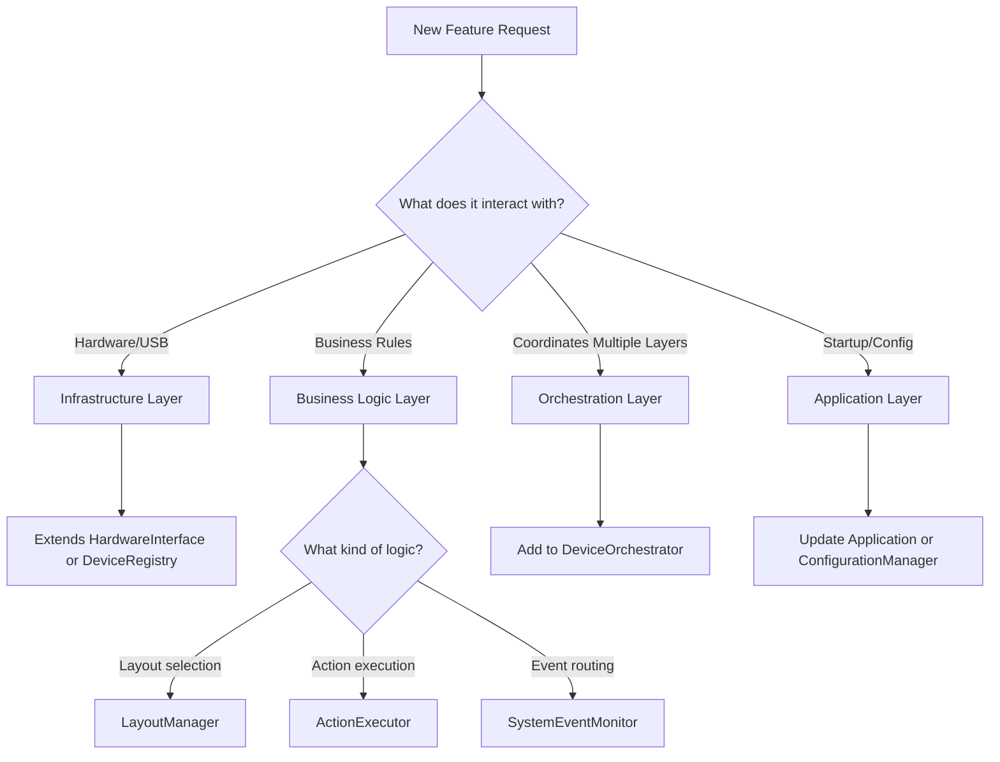

# Layered Architecture Migration Guide

## Overview

This guide helps developers migrate from the current architecture to the new layered architecture. It provides component mappings, migration patterns, and troubleshooting guidance.

## Component Mapping Table

### Old → New Architecture Mapping

| Current Component | New Component(s) | Layer | Notes |
|-------------------|------------------|-------|-------|
| `LockMonitor` | `SystemEventMonitor` + `DeviceOrchestrator` | Business + Orchestration | Logic split: event monitoring vs. device operations |
| `DeviceManager` | `DeviceRegistry` | Infrastructure | Renamed for clarity, enhanced with path-independent tracking |
| `WindowMonitor` | `SystemEventMonitor` | Business | Unified with other system events |
| `WindowUtils` | `LinuxSystemInterface` | Infrastructure | Wrapped, not replaced - delegated to |
| `HIDTransport` | `HardwareInterface` → `USBHardware` | Infrastructure | Wrapped in abstraction layer |
| `Layout.apply()` | `LayoutManager.render_layout()` | Business | Extracted from Layout class |
| `action_type.py` functions | `ActionExecutor` | Business | Organized into executor with plugin system |
| `ConfigLoader` | `ConfigurationManager` | Application | Cleaner separation from application logic |
| `main.py` | `Application` class | Application | Dependency injection container |

## Migration Decision Tree

### Adding a New Feature



### Fixing a Bug

1. **Identify the layer** where the bug exists
2. **Write a failing test** at the appropriate layer
3. **Fix the bug** within the layer boundaries
4. **Verify no layer violations** were introduced

## Migration Patterns

### Pattern 1: Extracting Business Logic from Device Operations

**Before:**
```python
# lock_monitor.py - Mixed concerns
class LockMonitor:
    def _handle_lock(self):
        # Event detection logic
        if self._is_locked():
            # Device operation logic (MIXED!)
            for device in self._devices:
                device.set_brightness(0)
```

**After:**
```python
# SystemEventMonitor (Business) - Pure event routing
class SystemEventMonitor:
    def _on_lock_detected(self):
        for handler in self._lock_handlers:
            handler()  # Just notify, don't do device operations

# DeviceOrchestrator (Orchestration) - Device operations
class DeviceOrchestrator:
    def _on_screen_lock(self):
        for device_id in self._registry.discover_devices():
            self._set_power_mode(device_id, PowerMode.STANDBY)
```

**Key Insight:** Separate *detecting* events from *responding* to events.

---

### Pattern 2: Path-Independent Device Tracking

**Before:**
```python
# device_manager.py - Fragile path-based tracking
class DeviceManager:
    def __init__(self):
        self._devices = {}  # {usb_path: device}
    
    def get_device(self, path):
        return self._devices.get(path)  # Breaks when path changes!
```

**After:**
```python
# DeviceRegistry (Infrastructure) - Stable ID-based tracking
class DeviceRegistry:
    def __init__(self, hardware_interface):
        self._devices = {}  # {device_id: DeviceState}
        self._hardware = hardware_interface
    
    def get_device_handle(self, device_id):
        # device_id is VID:PID:Serial, stable across reconnects
        state = self._devices[device_id]
        if state.needs_reconnect:
            self._reconnect(device_id)
        return state.handle
```

**Key Insight:** Use stable identifiers (VID/PID/Serial), not volatile system paths.

---

### Pattern 3: Dependency Inversion for Testability

**Before:**
```python
# action_type.py - Direct OS dependencies
def execute_command(cmd):
    subprocess.Popen(cmd, shell=True)  # Hard to test!
```

**After:**
```python
# SystemInterface (Infrastructure) - Abstraction
class SystemInterface(ABC):
    @abstractmethod
    def execute_command(self, command: str) -> None:
        pass

# LinuxSystemInterface - Implementation
class LinuxSystemInterface(SystemInterface):
    def execute_command(self, command: str) -> None:
        subprocess.Popen(command, shell=True)

# ActionExecutor (Business) - Uses abstraction
class ActionExecutor:
    def __init__(self, system_interface: SystemInterface):
        self._system = system_interface  # Injected, mockable!
    
    def _handle_command(self, config):
        self._system.execute_command(config['command'])
```

**Key Insight:** Depend on abstractions, not concrete implementations.

---

### Pattern 4: Event Handler Registration

**Before:**
```python
# Tightly coupled event handling
lock_monitor = LockMonitor(device_manager)  # Direct coupling
lock_monitor.start()
```

**After:**
```python
# Loose coupling through event registration
event_monitor = SystemEventMonitor(system_interface)
orchestrator = DeviceOrchestrator(registry, layouts, actions, event_monitor)

# Register handlers
event_monitor.on_screen_lock(orchestrator._on_screen_lock)
event_monitor.on_screen_unlock(orchestrator._on_screen_unlock)

event_monitor.start_monitoring()
```

**Key Insight:** Register handlers instead of hardcoding dependencies.

## Breaking Changes

### Change 1: Device Manager API

**Old API:**
```python
device_manager.enumerate()  # Returns list of device objects
device = device_manager.get_device(usb_path)
```

**New API:**
```python
registry.discover_devices()  # Returns list of device IDs (strings)
handle = registry.get_device_handle(device_id)
```

**Migration:** Use `DeviceManagerAdapter` during transition period.

### Change 2: Layout Application

**Old API:**
```python
layout.apply(device)  # Layout knows how to render itself
```

**New API:**
```python
layout_manager.render_layout(layout_name, device_id)  # Manager handles rendering
```

**Migration:** Layout definitions unchanged, but rendering logic centralized.

### Change 3: Action Execution

**Old API:**
```python
# Direct function calls
execute_action(action_config)
```

**New API:**
```python
# Through executor
action_executor.execute_action(action_config)
```

**Migration:** Minimal impact, mostly internal reorganization.

## Troubleshooting

### Issue: Import errors after creating new layers

**Symptom:**
```
ImportError: cannot import name 'DeviceRegistry' from 'StreamDock'
```

**Solution:**
Ensure `__init__.py` files exist in new package directories:
```bash
touch src/StreamDock/infrastructure/__init__.py
touch src/StreamDock/business/__init__.py
touch src/StreamDock/orchestration/__init__.py
touch src/StreamDock/application/__init__.py
```

### Issue: Circular dependencies

**Symptom:**
```
ImportError: cannot import name 'X' from partially initialized module 'Y'
```

**Solution:**
Check layer boundaries. Arrows should point DOWN the stack:
- Application → Orchestration
- Orchestration → Business + Infrastructure
- Business → Infrastructure
- Infrastructure → Nothing

If you have an upward dependency, use dependency injection.

### Issue: Test failures after migration

**Symptom:**
Tests that worked before now fail with "AttributeError" or "TypeError"

**Solution:**
1. Check if you're mocking the right interfaces (old vs. new)
2. Verify test fixtures match new component signatures
3. Update test imports to use new component locations

### Issue: Device not reconnecting after USB path change

**Symptom:**
Device works until unplugged and replugged, then stops working

**Solution:**
Ensure you're using `DeviceRegistry` with device IDs, not paths:
```python
# Wrong - fragile
device = registry.get_device("/dev/hidraw0")

# Right - stable
device_id = "1234:5678:ABC123"  # VID:PID:Serial
handle = registry.get_device_handle(device_id)
```

## Best Practices

### DO ✅

- **Keep layers independent** - Each layer should work without knowledge of layers above
- **Test at the right layer** - Unit test business logic without mocking, integration test orchestration with mocking
- **Use dependency injection** - Pass dependencies through constructors
- **Follow naming conventions** - `*Manager` for logic, `*Interface` for abstractions, `*Orchestrator` for coordination
- **Document layer responsibilities** - Update coupling diagrams when adding components

### DON'T ❌

- **Mix concerns** - Don't put device operations in event monitors
- **Hard-code dependencies** - Don't directly instantiate infrastructure in business logic
- **Cache USB paths** - Use stable device identifiers instead
- **Skip layer boundaries** - Application shouldn't directly call Infrastructure
- **Forget to update tests** - Every component change needs test updates

## Quick Reference

### Layer Cheat Sheet

| Layer | What Goes Here | Dependencies | Test Strategy |
|-------|----------------|--------------|---------------|
| **Application** | Config loading, DI container, main entry | Orchestration | E2E tests |
| **Orchestration** | Coordinate business + infrastructure | Business + Infrastructure | Integration tests with mocks |
| **Business Logic** | Layouts, actions, event routing | Infrastructure abstractions only | Pure unit tests |
| **Infrastructure** | Hardware, OS, external I/O | None | Unit tests with heavy mocking |

### When to Create a New Component

- **New hardware type?** → Extend `HardwareInterface`
- **New system event?** → Add to `SystemEventMonitor`
- **New action type?** → Register in `ActionExecutor`
- **New layout rule?** → Add to `LayoutManager`
- **New coordination logic?** → Extend `DeviceOrchestrator`

## Additional Resources

- [LAYERED_ARCHITECTURE_DESIGN.md](file:///home/speled/git_repositories/StreamDockForLinux/docs/architecture/LAYERED_ARCHITECTURE_DESIGN.md) - Full architecture specification
- [COUPLING_DIAGRAM.md](file:///home/speled/git_repositories/StreamDockForLinux/docs/architecture/COUPLING_DIAGRAM.md) - Visual dependency rules
- [LAYER_TESTING_STRATEGY.md](file:///home/speled/git_repositories/StreamDockForLinux/docs/testing/LAYER_TESTING_STRATEGY.md) - Testing approach for each layer
